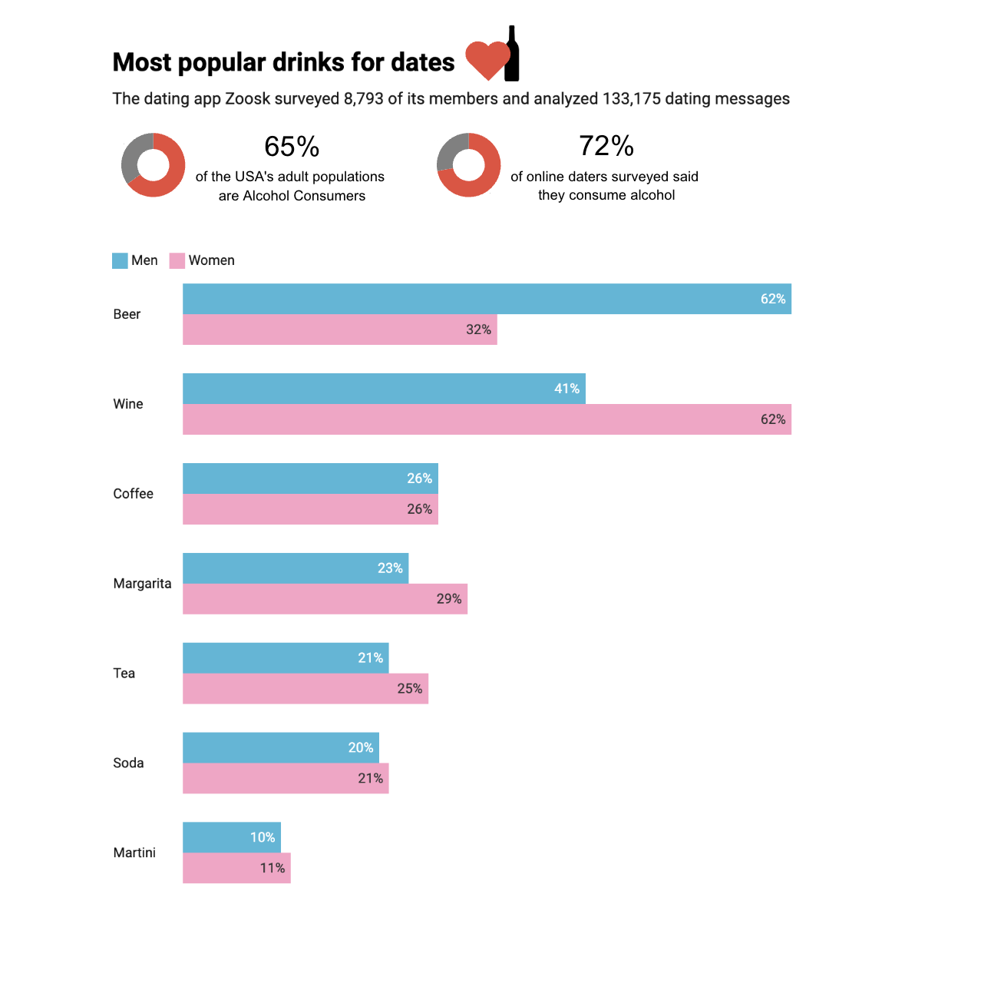

| [home page](https://nandini-mahurkar.github.io/nandini-dataviz-portfolio/) | [data viz examples](dataviz-examples) | [critique by design](critique-by-design) | [final project I](final-project-part-one) | [final project II](final-project-part-two) | [final project III](final-project-part-three) |

# Critique by redesign

I have chosen **Drink & Dating** data visualization from MakeoverMonday for this activity. 

_For each step below, you should document your progress as you move forward.  In terms of tone, think of the writeup as though you're keeping journal of your step-by-step process.   You should include a any insights you gained from the critique method, and what it led you to think about when considering the redesign.  You should talk about how you moved next to the sketches, and any insights you gleaned from your user feedback.  Document what you changed based on the user feedback in your redesign.  Finally, talk about what your redesigned data visualization shows, why you selected the data visualization you did, and what you attempted to show or do differently._

_You can include screenshots, sketches or other artifacts with your narrative to help tell the story of how you moved through the process.  Again, make sure to avoid including any personally identifying information about your interviewees (don't list full names, etc.).  While this template serves as a guide, make sure to reference the assignment writeup on Canvas for the official guidance.  This template does not include all guidance mentioned on the assignment page._

## Step one: the visualization

_Include link to the original data visualization (or screenshot - make sure to correctly cite your sources, etc.).  Include paragraph or two on why you selected this particular data visualization.  For obvious reasons, the data visualization you select should come from a publicly accessible source._

[Click on this link to view the original data visualization!](https://dribbble.com/shots/10539609-Drink-and-Dating-Infographics)

Why I chose this visualisation:
1. The topic, dating & drinking is relatable for a wide audience, as compared to technical or niche data visualizations. So, my intent is for the general audience to understand and interpret this visualization.
2. The bar comparison between men and women provides valuable insights, but the graph is challenging to interpret. My goal is to make the visualization clearer and more user friendly.
3. This visualization has some unclear wording, like the phrase '65% of the USA’s adult populations are drink,' which can be confusing. By critiquing it, I want to make sure the information is clear, accurate, and easy to understand.

## Step two: the critique
_Don't forget to complete the Google Form found on the assignment page.  You can summarize your thoughts here._

The visualization at the first glance is distracting. 
1. At the top, two hearts are used, where the first one is completely red for 65% and the second one is partially red even though it is representing 72%. This is inconsistent and can easily confuse the viewers. 
2. The text for the heart displaying 65% is incomplete. The percentage 65% appears in gray, while 72% is shown in red. To maintain consistency, both 65% and 72% should be in the same color.
3. The headline is vague and not appealing. Using something like "Most Popular drinks for dates" or "Daters' Drink Preferences" is better.
4. Using two bar charts side-by-side is confusing. Instead using a grouped bar chart is better. 
5. Using different colors for the two genders would be better as we will be able to clearly distinguish between the two.
6. The bar charts are not sorted properly. The bars should be sorted on either of the two genders, according to the percentages.
7. The percentages lack a scale, and the differences between the percentages cannot be perceived properly. 

What I liked & What stood out:

1. The text is concise and conveys the information effectively.
2. Use of a bottle to represent the drinking percentage.
3. I like the mention of the app 'Zoosk' and the statistics of survey. This makes the viewers believe that the data is reliable. 
4. Clear and straightforward comparison of the daters with the US population.

## Step three: Sketch a solution

My approach for the redesign was to make the data easy to read and understand, as the topic is relatable for the general population. So, I first started with the title, as the original one is too vague. I changed it to : Most popular drinks for dates. I want the viewers to trust the data, so I kept the mention of the app Zoosk, and the details of the survey. Next, I replaced the hearts with donut charts, to make it more readable. But, I added a little heart and a bottle icon beside the title to better represent the data visualization. I replaced the side-to-side bar charts, to a grouped bar chart, as the original bars were distracting. They were not sorted in any order, and added to the confusion.I used a blue bar for men and a pink bar for women to make the visualization easier to interpret.

## Step four: Test the solution

Interview 1: Student, MAM
Interview 2: Student, MISM & MAM 
Interview 3: Student, MISM-BIDA 

| Question | Interview 1 | Interview 2 | Interview 3 |
|----------|-------------|-------------|-------------|
| What is this graphic about? | Most popular drinks by gender for dates | Comparison of men's and women's drink preferences on dates| Most popular drinks by gender for dates |  
| Is there anything you find confusing? | No            | The two percentages next to the donut chart are confusing            | The two percentages next to the donut chart are confusing |
| Who do you think is the intended audience? |  People who date           | Alcohol companies, advertising companies            | People who date   |
| Is there anything you would change or do differently? |  No           | Pick one story, and stick to it.            | Remove the percentages next to the donut chart   |
| Are the colors too overwhelming? |  No           | No            | No   |

Synthesis: 

_What patterns in the feedback emerge?  What did you learn from the feedback?  Based on this feedback, come up with what design changes you think might make the most sense in your final redesign._

## Step five: build the solution

_Include and describe your final solution here. It's also a good idea to summarize your thoughts on the process overall. When you're done with the assignment, this page should all the items mentioned in the assignment page on Canvas(a link or screenshot of the original data visualization, documentation explaining your process, a summary of your wireframes and user feedback, your final, redesigned data visualization, etc.)._

## References
_List any references you used here._

## AI acknowledgements
_If you used AI to help you complete this assignment (within the parameters of the instruction and course guidelines), detail your use of AI for this assignment here._

