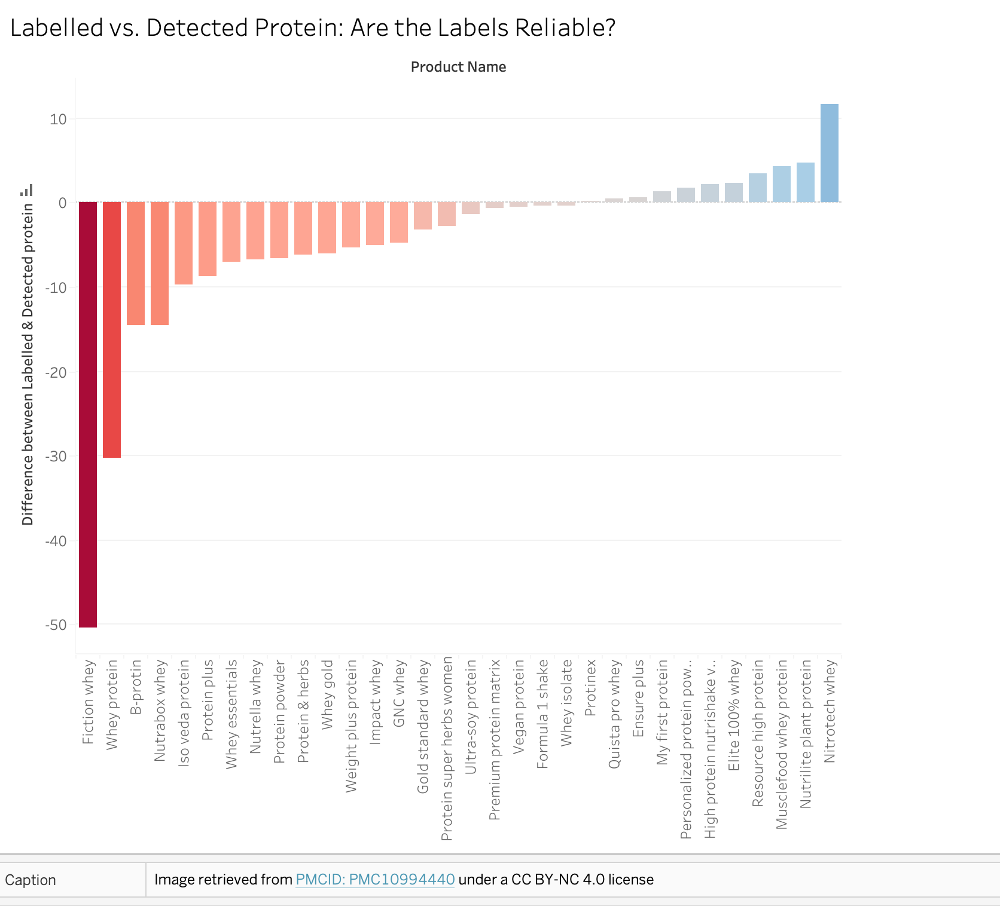
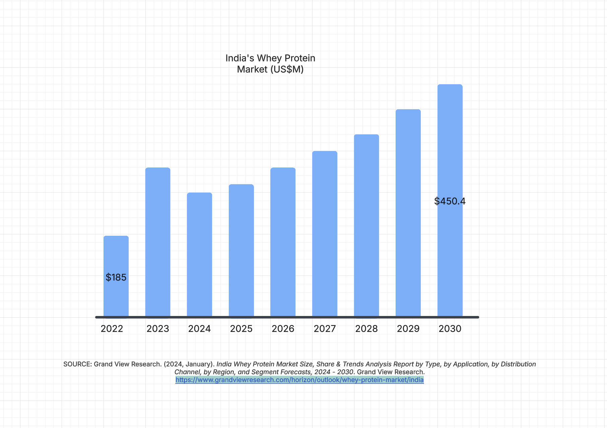

| [home page](https://nandini-mahurkar.github.io/nandini-dataviz-portfolio/) | [data viz examples](dataviz-examples) | [critique by design](critique-by-design) | [final project I](final-project-part-one) | [final project II](final-project-part-two) | [final project III](final-project-part-three) |

> Important note: this template includes major elements of Part I, but the instructions on Canvas are the authoritative source.  Make sure to read through the assignment page and review the rubric to confirm you have everything you need before submitting.  When done, delete these instructions before submitting.

# Outline

My project focuses on addressing the issue of adulteration in growth supplements, with a particular emphasis on the rise of whey protein consumption in India. An independent, self-funded study conducted on protein supplements revealed a disturbing truth: the majority of products did not contain the advertised protein content. In addition to these fraudulent claims, the study uncovered the presence of fungal toxins, heavy metals, and pesticides in several reputed brands.

Through this project, I aim to visualize this alarming research in a way that is easily understandable for the average consumer. It is truly shameful that brands with such low-quality standards often target the active and health-conscious community, deceiving them into purchasing products that are, at best, misleading and, at worst, dangerous to consume.

# As a user I want....

As a reader, I want to learn more about the safety of protein supplements that I regularly consume so that I can make the right consumer choices for my health and safety. I can do this by learning more about the QC in different popular supplement brands.

## Initial sketches
The following sketches represent the whey protein usage in India as well as the Differnces that were present between the Labels and detected protein. These are my initial sketches that I plan on using for developing my case.

# The data
> A couple of paragraphs that document your data source(s), and an explanation of how you plan on using your data. 

Text here...

> A link to the publicly-accessible datasets you plan on using, or a link to a copy of the data you've uploaded to your Github repository, Box account or other publicly-accessible location. Using a datasource that is already publicly accessible is highly encouraged.  If you anticipate using a data source other than something that would be publicly available please talk to me first. 

| Name | URL | Description |
|------|-----|-------------|
|      |     |             |
|      |     |             |
|      |     |             |

# Method and medium
> In a few sentences, you should document how you plan on completing your final project. 

Text here...

## References
_List any references you used here._

## AI acknowledgements
_If you used AI to help you complete this assignment (within the parameters of the instruction and course guidelines), detail your use of AI for this assignment here._
